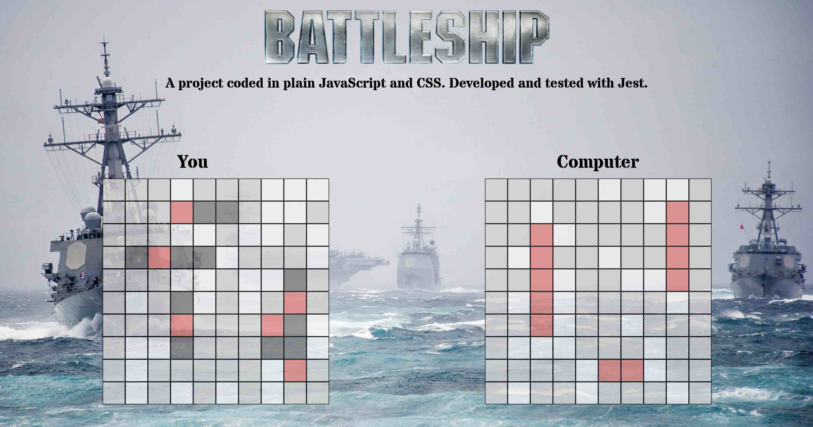

# Battleship TDD project ⛴

**Battleship game with test-driven-development, written in plain JavaScript.**  

**This code has many refactoring/additional feature opportunities, including:**
- defining ships one time, therefore using fewer arrays
- a shuffle ships function instead of location.reload()
- manual ship placement with mouseover events

**Best viewed on 🖥 desktop!**  

**See it live at (https://rusty-reebs.github.io/tdd-battleship/)!**  

Date completed: November 2, 2021  

Objectives: use Jest unit tests to develop the classic game of Battleship. Organize code with factory functions and modules. Keep DOM manipulation separate from game logic.  

### Screenshot
-----

  

### TIL Things I Learned
-----

- how to write unit tests with Jest
- how to set up Jest with webpack and Babel for import and export
- more practice with array methods
- more practice with objects and factories

